# Case Study:
	As I got hired at as a ‘Junior web Designer’ at A4people, first task that my employer assigned me was to design company’s new website. After analyzing my academic and technical knowledge, board give me overview of their need and user expectation from website. After gathering all the information, I proposed video streaming website (FlixTube) for A4people company which was accepted then I have to make a website design document. 
# Requirements:	
	Website should have a consistent design. It should contain multiple pages. The landing page should be clear and should not look crowded. Information should be conveyed easily. Website should be responsive. Website should have easy navigation.
	User should be able to view trending videos, signup for memberships, comments on video and like the video. User should be able to contact the team.
	Content should be divided with categories. Should have search option.
# Pages:	
	Flixtube contains following pages:
- Landing page:
Main page of website when user open our website, it displays trending videos , main content, subscription section and side bar with relavant categories and tags.
- About us page:
It shows team of company and general overview of company.
- Video streaming page:
It shows how the video streaming will happen on website with stats of videos, uploaders description and other things. User can post its review and like dislike video.
- Contact us page:
It shows company location and address. Also it shows office timings. It also has a form if user want to connect with company.
- Search result page:
Its shows how user result will be displayed when user want to search a specific content on website.

Each pages is divided into multiple sections that are:
-	Header
-	Navbar
-	Main Section
-	Main content
-	Sidebar
-	Footer
By dividing content, it make website look neat and clean, navigation is easy plus it make suer to stay longer on website.

	
# Paper Sketches:	
	Starting by sketches, I drew my idea on a paper so I can have a clear outlook of what I am trying to design. I shared these rough sketches with the stakeholders, just to make sure that we were on same page. These sketches were the cornerstone for this whole design project. Sketches help me designing overall structure of website and dividing content into multiple sections.

- Main page:

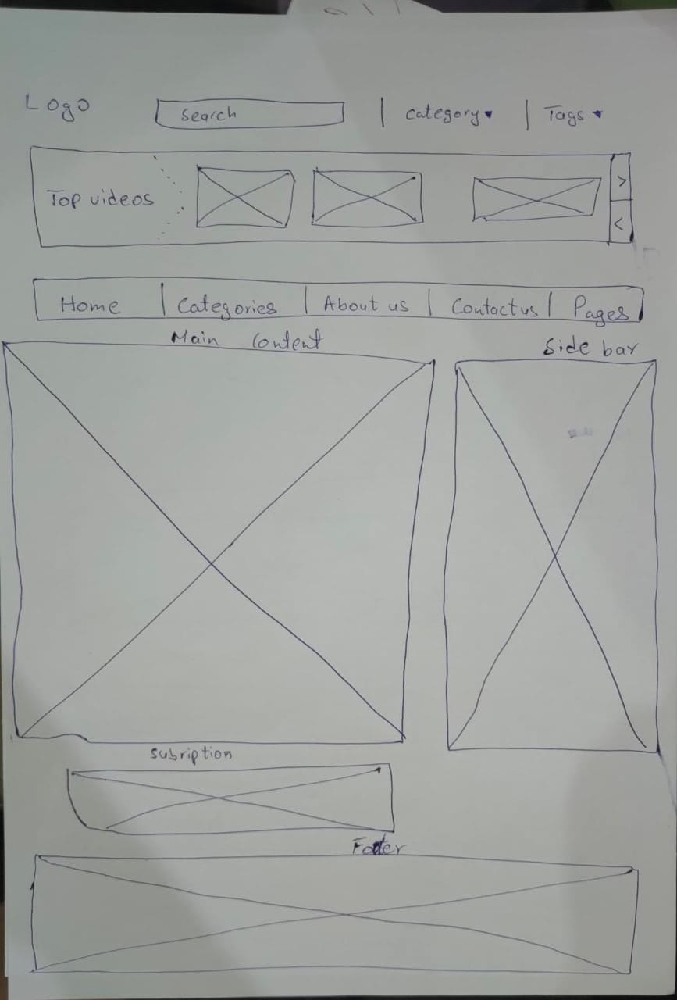

- Streaming page:
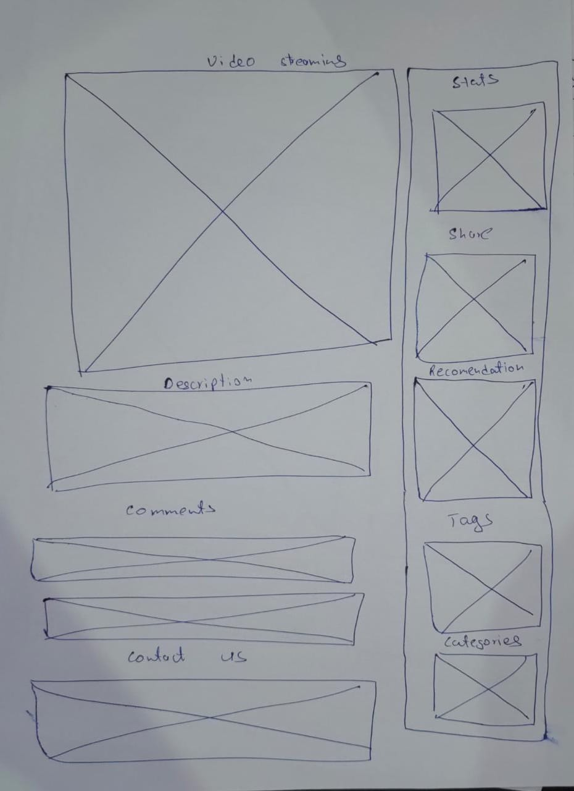
This was just tentative overview of how the content will organize and displayed. 

# Wireframes:	
 	After my sketches, I converted them into wireframes that helped the stakeholders to understand how website components will be places on website. This is general overview of sketch in a digital form so that stakeholders can see how the content will be divided into sections , what will be the size of section relevant to other sections.

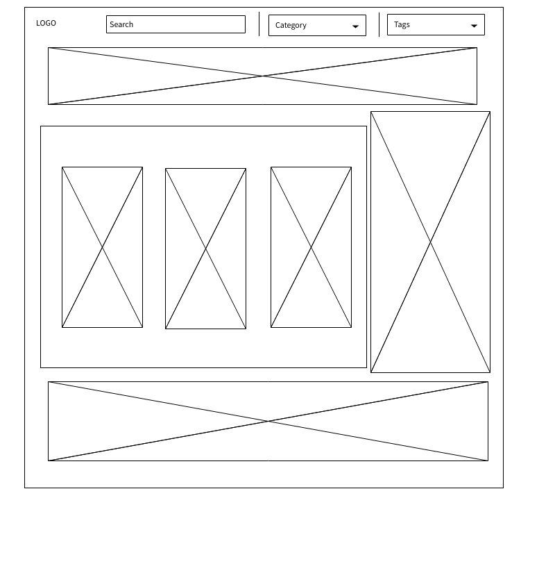	
 
 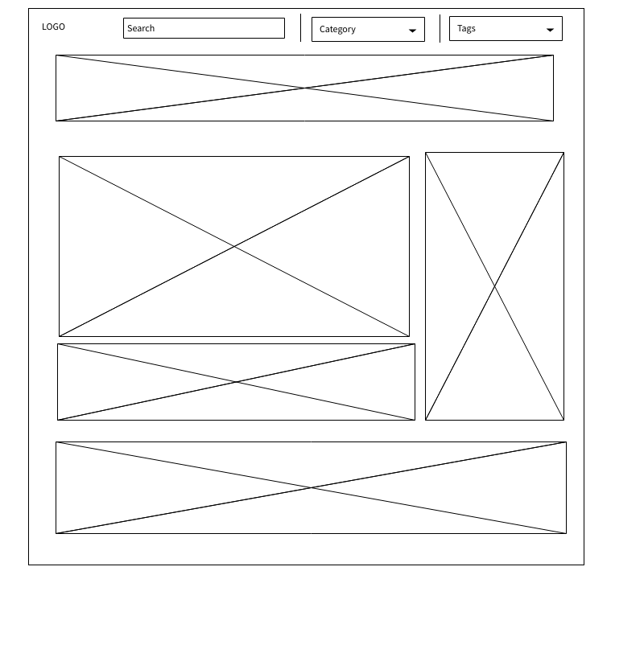	

# Design Schema
	Colors used:
  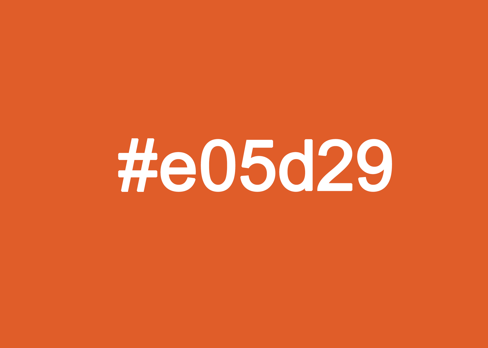	
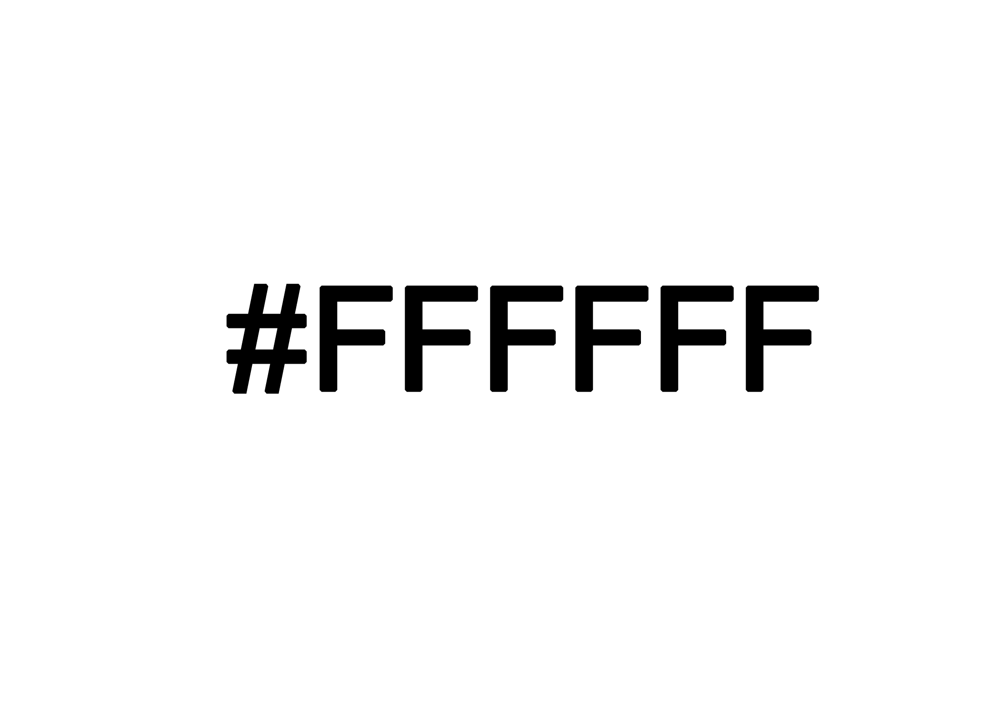
	Fonts used:
	Fontawesome-webfont

# Tools:
	During my interview phase, I come to conclude that building and developing a large scale website should be develop  by coding , not using drag and drop tools as it may at some stage make your dependency worst.
	So I have used HTML and CSS with the help of Bootstrap to customize A4people website. Also I have used JavaScript and its library jQuery for dynamic client interaction.
    Backend can be build with cloud storage option as this is streaming website which demands high bandwidth and speed so developing backend will be a tough task.
	Website is critically analyzed first through sketches then it was converted to relevant design using define tools. Website is responsive with Gris system (media queries) which are pre define in bootstrap.

I've used the following images, icons or other files as listed:

•	Bootstrap by Twbs
•	Font Awesome by Dave Gandy
•	Modernizr by Modernizer Team
•	Easing Plugin by George McGinley

For dummy content, I have used Vimeo.

# html structure

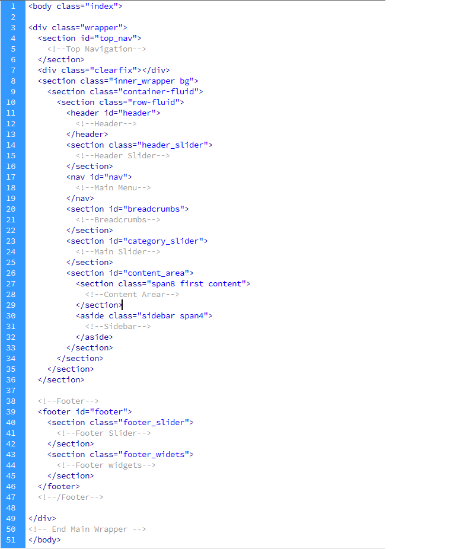

# Critical review:
	Multimedia websites should be easy to navigates and user should not loss on website. It should be able to display and load content fast. As Flixtube is mainly streaming service website, so I as user want no delay and fast results except my slow connection which don’t relate with website server or deign. So, content should be optimized, easy to navigate and search so that user should see everything clearly and should adapt to user interface. Color should be eye catching for users as they keep user attention attract to website. Content should not be overcrowded.
	I followed my initial design setup to development setup while keeping all the key design concepts in my mind. Website is developed with first on rough paper , then dividing sections using wireframes then defining overall structure first. I breakdown the development process into 3 steps: dividing sections according to requirements , defining structure of overall website and then apply my designing sense on specific portion one by one.
	Flixtube contains 5 pages. Each page is divided into sections. I have consider this a membership base platform, so I have added membership forms on landing page also. I have made use of breadcrumbs so that user don’t loss on FlixTube while navigating through multiple pages. I have added buttons or icons to follow on social media pages for a company so that users keep engage or keep up to date with company new announcements. Users can interact with videos through comments and give their feedback so I have added comments and like and dislike feature on video page so that user should know the overall review of content. User can search specific content on website , so I have added search page to display how the content will be displayed with user search keyword.
	Overall design is neat and clear, as I have followed the initial design steps and get approval from stakeholders so that we were on same page at each stage of development. Each goal and requirement of stakeholders and suer is fulfilled as per my final design or product.

# Visuals:

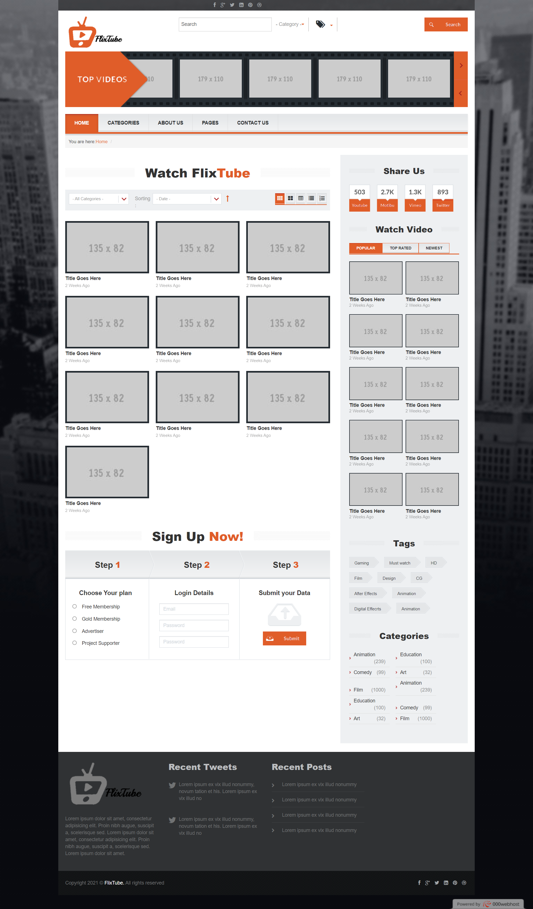

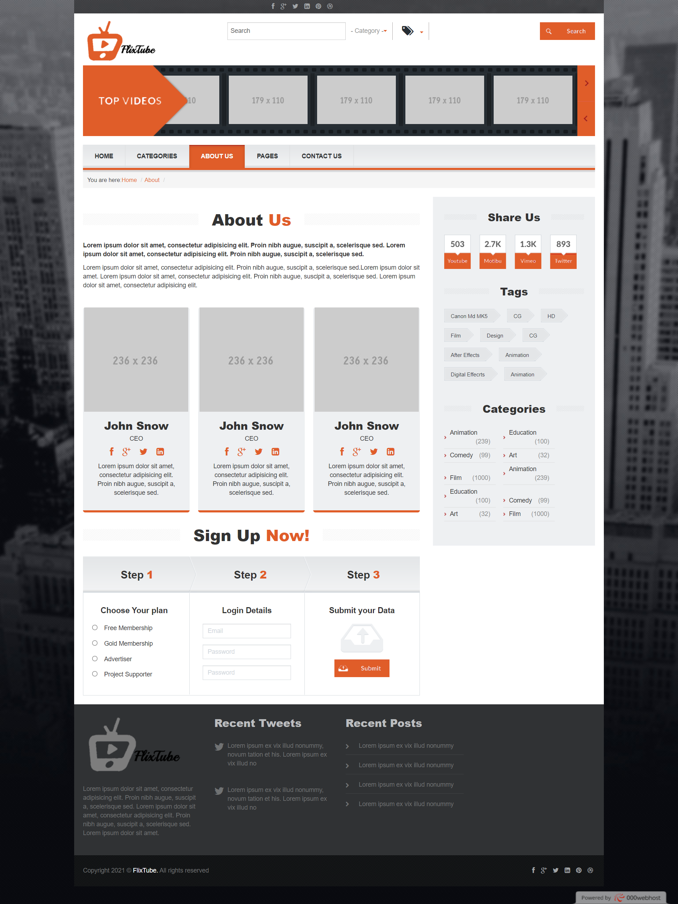

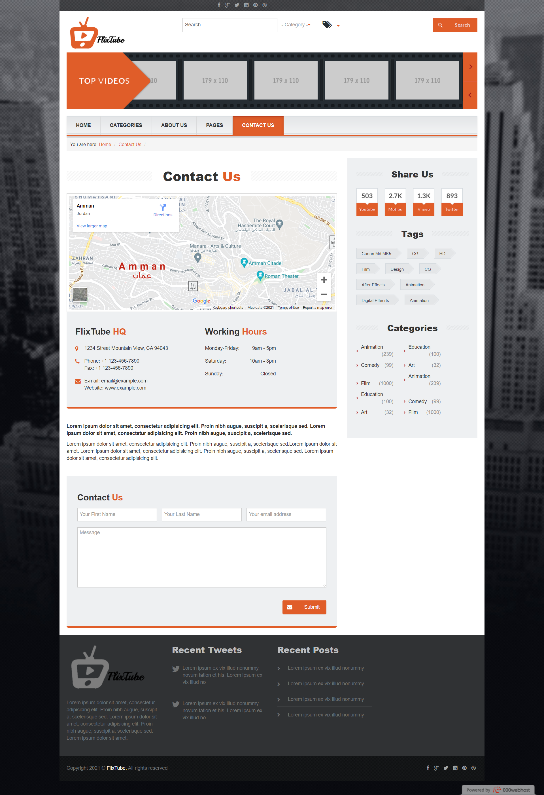

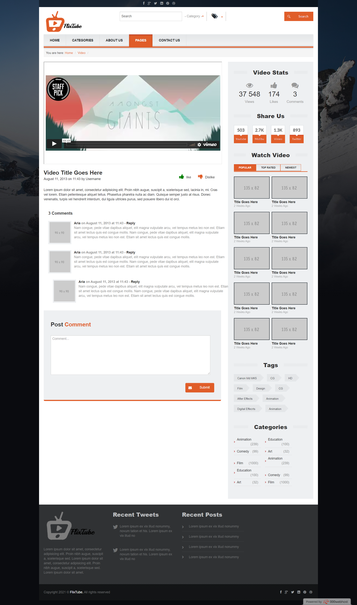

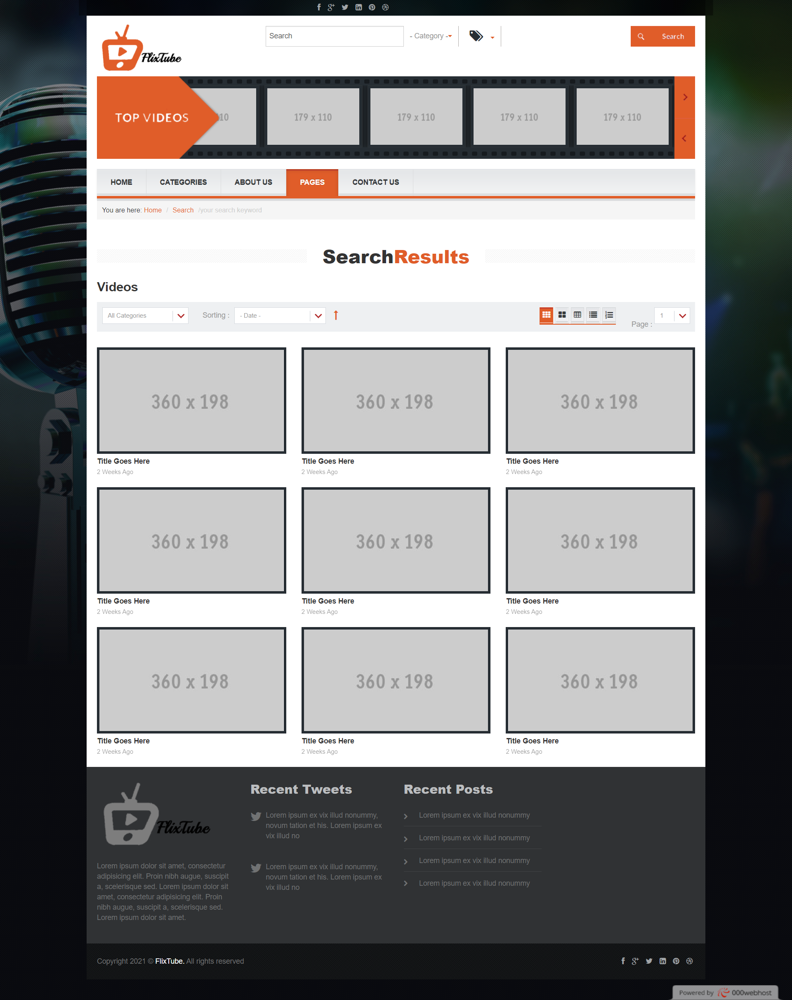